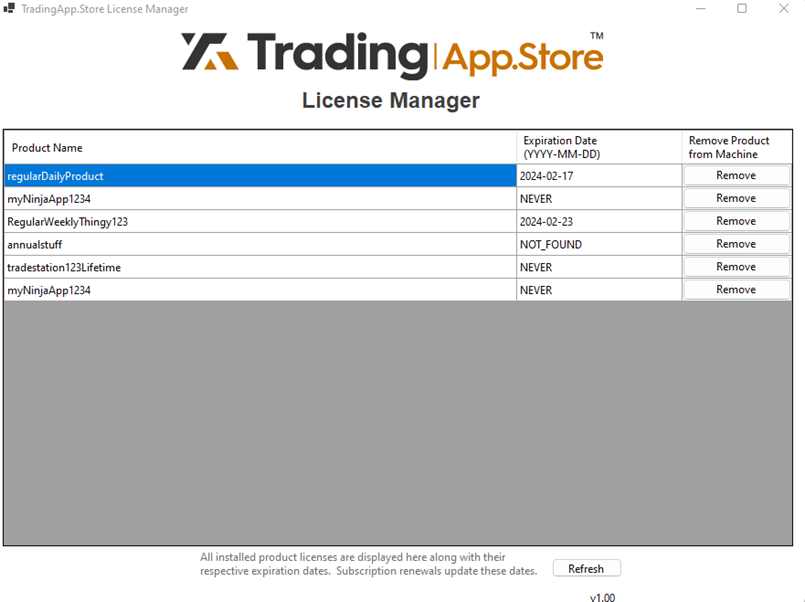

# TradingAppStoreExamples-TradeStation
## Description
TradingApp.Store offers a comprehensive software suite enabling vendors to verify user permissions for their products. The suite comprises digitally signed Dynamic Link Libraries (DLLs) containing API functions accessible via EasyLanguage scripts integrated into your software.

## Setup
Go to [vendors.tradingapp.store](https://vendors.tradingapp.store/app), create or sign into your vendor account.  Should you already be an end-user of products in the trading app store, then you should create a vendor login using the same email address as your existing app store's end-user login.  These are two seperate systems, so you will need to register for each individually.  By using the same email address for each, the store will know to link your vendor account to your end-user account so that you will only have to install one License Manager.  Then, once your License Manager is installed, you will then have a choice of flipping from 'Vendor Test Mode', back to 'End-User Mode' within the License Manager software.  After you created a new Vendor account, or logged in, then click the gear at the top right and choose 'Settings', then on the left side click 'Vendor Page' and setup your Vendor Profile page.  This is where you insert your company logo or icon (500x500 pixels works best.)  Next, enter a company bio or description, and contact information.  Now Send for Approval. Once approved this enters you into the  [Vendor Directory](https://tradingapp.store/pages/vendor-directory).  Next create your first product listing by clicking 'Listings' at the top of the page, and then 'Create Listing' button at the top right. Proceed to fill out the Product Listing form.  Instructions below.

### Product Name:
Fill out a Product Name at the top left and a SKU will be automatically produced at the bottom of the page (this will identify your product on our servers). 

### Product Description:
Create a formated product description in an editor like Word or Google Docs and then paste it into the Product Description text-box. Read over it and do a final editing of the formatting to make sure it looks right. The product description should fully explain your product, its features, benefits, and how it works. Give as much detail as possible.

### Images:
Add images and/or videos one at a time. Most file common file types are accepted. You can also use online videos from YouTube via the URL link.

### Listing Types:
Check all that apply to this product.  Your product may fit into more than one Listing Type.  

### Subscription Options:
Choose the type of billing scheme to use. Available options are: Lifetime, Annual, Monthly, Free Trial + Monthly, Free Trial + Annual, Free Trial + Lifetime.

### Webhook Link:
If you have a real-time listening application that works with Webhooks, paste the link to it here to be notified when a purchase for this product is made.

### Purchase Email:
If you would like email notifications upon purchases, place the receiving address here.

### Target Platform:
Choose TradeStation

### TradeStation customer number:
Enter your TradeStation customer number which can be found in the 'Help | About TradeStation' section.  This is used to create your master key license for integration testing on your copy of TradeStation.

### SKU:
Unique self-created product identifier that you will use in your script while accessing the DLL.

### Download MSI:
(NOTE: You must pick a 'Target Platform' and enter 'TradeStation customer number' in order for the 'Download MSI' button to appear.)  Press this to download a copy of the 'TradingApp.Store License Manager' that is master-keyed to this specific product and specifically to your TradeStation customer number.  This provides you, the Vendor, the ability to test the integrations of your products with our DLLs.  After installing this MSI, launch the TradingApp.Store license manager application to see the generated license.  


  

Your system is now ready for seamless integration with our platform.

## How it works
The DLL will automatically detect a license in the TradingAppStore/licenses folder and then will determine if the user has permission. If the license is expired, or a newer version of the license is required, then the DLL will automatically update the license to contain the new information. Consequently, users need only execute the installer once to access any trading apps or software included with their current or future purchases.
The TradingAppStore DLL also offers a hardware authorization option that only allows a certain number of devices to access one instance of your product. This adds an additional layer of security by preventing copies of a DLL / product from gaining permission.
You may download the installer for TradingAppStore from the vendor portal whenever you are in the process of creating a listing. All licenses created from the vendor portal are tagged with a “Debug” flag, so they will not have any functionality in release mode. Thus, BE SURE TO CHANGE THE DEBUG FLAG TO FALSE AFTER COMPLETION OF TESTING PHASES.

### DLL Inputs
The DLL must have 3 input values:
* string customerID :   TradeStation Customer Number found in Help | About
* string productID :    SKU of the product that was self generated above.
* bool debug :          set to True if you are testing to use Debug licenses distributed by the vendor portal. SET TO FALSE FOR RELEASE VERSION OR ELSE ANYONE WILL HAVE ACCESS TO YOUR PRODUCT
  
## Implementation
Below is an EasyLanguage implementation that calls the UserHasPermission function of the TradingAppStore DLL:
```pascal

Using elsystem;
Using tsdata.common; 
Using elsystem.collections;
Using elsystem.io;
Using elsystem.net;

// import our DLLs
DefineDLLFunc: "C:\ProgramData\TradingAppStore\x86\Utils.dll", int, "GetMagicNumber";
DefineDLLFunc: "C:\ProgramData\TradingAppStore\x86\TASlicense.dll",  int, "UsePlatformAuthorization", lpstr, lpstr, bool;

vars:
intrabarpersist string sProductSKU("ProductSKUfromVendorPortal"),	//get this from your product listing page on the Vendor Portal in the Software Details section
intrabarpersist bool bVendorDebugMode(true);	//set to True if you are testing to use Debug licenses distributed by the vendor portal. SET TO FALSE FOR RELEASE OR ELSE ANYONE WILL HAVE ACCESS TO YOUR PRODUCT

//This method returns if user has access or not as a bool, and should be called from your code to allow/deny access to your script.
method bool Has_Access()
vars: StreamReader myFile, string magicNum, WebClient wc,WebHeaderCollection headers, string json, string verifyDllResponse, string TS_CustomerNumber, string productId, bool debug, int authResponse, bool dllValid, bool returnBool;
Begin
    // This gets a one-time-use magic number from a utility dll
	GetMagicNumber();
	
	myFile = StreamReader.Create("C:\ProgramData\TradingAppStore\temp\magic.txt", True);
	magicNum = myFile.ReadToEnd();
	myFile.Close();
	
	// Now, let's send that magic number to the TAS server to be verified
	wc = WebClient.Create();
	wc.Headers.Add("Content-Type: application/json");
	json ="{" + Doublequote + "magic_number" + Doublequote + " : " + Doublequote + magicNum + Doublequote + "}";
	dllValid = false;
	try
		verifyDllResponse = wc.UploadString("https://tradingstoreapi.ngrok.app/verifyDLL", json);
		print("VerifyDLL response: " + verifyDllResponse);
		dllValid = verifyDllResponse = "ACCEPT";
	catch(elsystem.exception ex)
		print("VerifyDLL returned exception " + ex.Message);
	end;
	
	// After verifying the DLLs, you can safely use them to authorize your customers.
	if dllValid Then
	begin	
		// Setup TradeStation Customer ID string 
		TS_CustomerNumber = "TradeStation-" + Customerid.ToString();
		
		// Perform user authentication using TAS Platform Authorization
		authResponse = -1;	//initialize to non-zero number
		authResponse = UsePlatformAuthorization(TS_CustomerNumber, sProductSKU, bVendorDebugMode);
		Print("TAS auth response ", Numtostr(authResponse, 0)); 
		// 0 = success, 1 = expired, 2 = wrong customerId, 3 = cannot use Debug license in Release Mode, 4 = invalid ProductID, 5 = Too many user instances.  6 = billing failure.  7 = File Error.  8 = other error
	end;
	
	returnBool = dllValid and authResponse = 0;
	
	if returnBool Then
			Print("Access Granted") else Print("Access Denied");

	return returnBool;	
end;

method void AnalysisTechnique_Initialized( elsystem.Object sender, elsystem.InitializedEventArgs args ) 
begin
	//Comment out the following line to bypass the TAS authentication.
	if not Has_Access() Then RaiseRuntimeError("-- You are not authorized to use this product.  Please contact support@tradingapp.store");
end;
```

### DLL Return Values
The DLL will return various error values based on numerous factors. It is up to your application how to handle them.
```
0 - no error
1 - expired
2 - wrong customerId
3 - cannot use Debug license in Release Mode
4 - invalid productId
5 - Too many user instances. Only for TAS Authorization. Contact support@tradingapp.store
6 - billing attempt not found... likely expired
7 - internal error
8 - File Error
9 - other error
```
## Finishing Up
Go back to the Vendor Portal to complete your product setup.

### Upload Software Here:
Once your product is successfully integrated into our permissions system, take the product out of debug mode (see bool debug above), and export as a protected ELD.  If you have accompanying files, workspaces, symbol lists, etc, it is required that you zip everything into one file, and then upload it here.  This is what will be distributed to end-users at the time of purchase or free trial.

### Sales Information - Set Price:
This is the price per period for the subscription term of the product.  Revenue splits are explained in the Vendor Policy (https://tradingapp.store/pages/vendor-policy).

### Send for approval:
Click here to send this listing for approval by TAS site moderators.  You will be notified by email upon acceptance or rejection.


## Other Notes
The TradingApp.Store License Manager has the ability to switch between ‘End-User’ mode, and ‘Vendor Test Mode’ by-way of a checkbox at the top right of the TAS Lisence Manager labeled:  ‘Vendor Test Mode’.
When it's checked, only Vendor's products show in License Manager’s DataGrids, when unchecked, only End-User products show in DataGrids.
If a Vendor is also an End-User of other’s products, they must use the same email address during registrations of  each mode for this to work.  This enables one installation of this License Manager to handle both integration testing while in Vendor Mode, and alternatively using End-User mode for purchased products use.


## Further Help
If you need assistance in implementation, you may email support@tradingapp.store and we will respond as quickly as possible.
